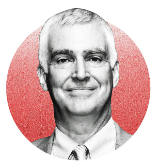
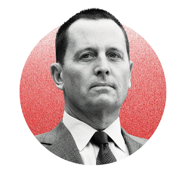
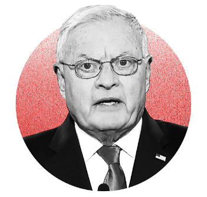
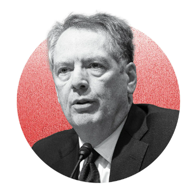
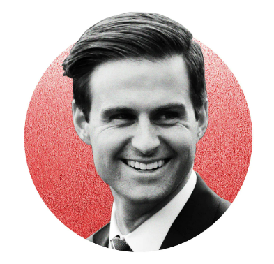
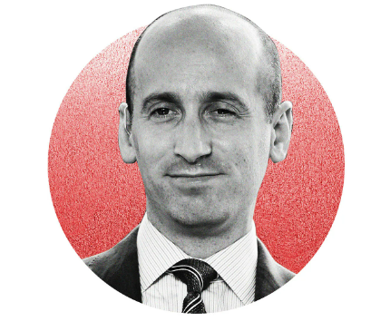
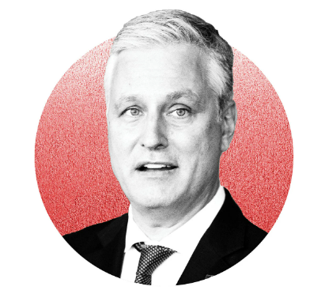
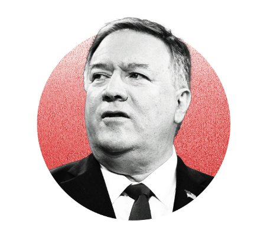

+++
title = "谁在影响特朗普的外交政策?"
date = 2024-11-09T19:20:32+08:00
images = []
tags = []
categories = []
draft = false
+++
认识这11位正在塑造2024年共和党总统候选人世界观的关键人物。

如果美国前总统唐纳德·特朗普再次入主白宫,他的外交政策会是什么样?评估特朗普可能的第二任期外交政策议程的一个重要方法,就是了解他身边的核心国家安全智囊:他听取哪些顾问的建议?是什么样的思想在影响这位前总统当前的世界观?

<!--more-->
原标题：Trump’s Foreign-Policy Influencers

来源：https://foreignpolicy.com/2024/08/26/trump-foreign-policy-influencers-us-election-china-trade-nato-ukraine/

## 埃尔布里奇·科尔比

埃尔布里奇·科尔比（Elbridge Colby）曾经是特朗普政府的国防官员，他是华盛顿最响亮、也许也是最有说服力的声音，他主张从欧洲、北约和俄罗斯彻底转向来自东方大国的日益增长的挑战。

科尔比在特朗普政府担任了一年多的国防部副助理部长，在那里他帮助美国为迟来的重返亚洲行动注入了活力。然后，他与其他特朗普政府资深人士一起共同创立了马拉松计划（Marathon Initiative），这是一个总部位于华盛顿的智库，专注于大国竞争。如果他在未来的特朗普政府中再次获得机会——而且他的名字已经被提名为另一个国防职位，甚至是国家安全委员会（National Security Council）的工作——他将明确他的[首要观点](https://foreignpolicy.com/2024/01/12/elbridge-colby-ukraine-israel-gaza-china-taiwan-elections-threats/)：东方大国，而不是俄罗斯，是美国最大的问题。

多年来，科尔比在一系列文章、[书籍](https://www.amazon.com/Strategy-Denial-American-Defense-Conflict/dp/0300256434)和演讲中一直呼吁美国利用其有限的国防资源来防止敌对霸权大国在亚太地区占据主导地位。东方大国已经在经济上吓倒了许多较小的邻国，并继续削弱南海等地的地区安全。但台湾省才是真正的考验：如果东方大国试图以武力重新吞并该岛，将意味着与美国发生冲突，甚至可能与日本发生冲突——如果成功，将使东方大国有机会控制整个太平洋盆地，而太平洋盆地是迄今为止世界上最重要的经济区域。

科尔比的想法是对[尼古拉斯·斯皮克曼 （Nicholas Spykman](https://www.amazon.com/Americas-Strategy-World-Politics-Balance/dp/1412806313)） 在二战中期撰写的美国大战略原始蓝图之一的及时报复，但后来却颠倒过来了：亚洲，而不是欧洲，现在是世界的经济和政治重心，北京对它的主导将严重限制美国的未来前景和行动自由。

科尔比面临的一个问题是，他潜在的未来老板虽然有时愿意对东方大国充满敌意，但也[完全是交易](https://foreignpolicy.com/2024/07/17/trump-taiwan-policy-rnc-tsmc-chips/)性的，而特朗普已经表示他愿意用台湾省的自治来交换。像科尔比这样的现实主义鹰派往往对[没有真正北方](https://foreignpolicy.com/2024/03/06/trump-john-bolton-us-elections-2024-isolationism/)的外交政策感到不安。

另一个问题是，科尔比大声疾呼并一再敦促将有限的美国资源专门用于有朝一日可能到来的东方大国大战，即使这意味着在战争中放弃乌克兰，这对[克里姆林宫的暴](https://x.com/JuliaDavisNews/status/1809265232469954596)徒来说是污秽的;俄罗斯国家电视台为科尔比的外交政策重点欢呼。

无论如何，立法者可能不会在未来的特朗普政府或未来的卡玛拉·哈里斯（Kamala Harris）政府中购买仅限亚洲的防御战略。一个由国会授权的国防审查小组[在 7 月指出](https://foreignpolicy.com/2024/07/29/us-national-defense-strategy-commission-review-report-biden-war-planning/)，美国应该准备捍卫其在欧洲和亚洲的重大利益。

*——基思·约翰逊*

## 弗雷德·弗莱茨

尽管弗雷德·弗莱茨 （Fred Fleitz） 是美国国家安全界的长期成员，但他是特朗普驱动的反建制 MAGA 意识形态的坚定支持者，该意识形态在华盛顿肆虐了四年。弗莱茨是特朗普政府的资深人士，在竞选过程中，他已成为前总统为数不多的国家安全高级顾问之一。

弗莱茨与基思·凯洛格 （Keith Kellogg） 一起起草了一份供特朗普[审查](https://www.reuters.com/world/us/trump-reviews-plan-halt-us-military-aid-ukraine-unless-it-negotiates-peace-with-2024-06-25/)的计划，旨在如果特朗普赢得连任，就结束乌克兰战争。该计划需要推动乌克兰和俄罗斯坐到谈判桌前，并在目前的战线上斡旋暂时停火，这将在和平谈判期间维持。特朗普政府一方面威胁说，如果不谈判，就切断美国的援助，一方面向乌克兰施压，另一方面威胁要在不进行和平谈判的情况下打开美国对乌克兰军事援助的闸门，从而向俄罗斯施压。该提案标志着如果弗莱茨和他身边的其他人加入政府，特朗普的白宫乌克兰政策会是什么样子，这是迄今为止最详细的预演。

弗莱茨是美国优先政策研究所美国安全中心的副主席，该智库成立于 2021 年，目的是在拜登团队上台时让 MAGA 靴子在华盛顿实地工作。他是右翼新闻频道 NewsMax 的定期评论员，著有《[*奥巴马炸弹：危险且不断增长的国家安全欺诈*](https://www.amazon.com/gp/product/B01J0E8XVY?ie=UTF8&tag=thewaspos09-20&camp=1789&linkCode=xm2&creativeASIN=B01J0E8XVY)》和[*《即将到来的朝鲜核噩梦：特朗普必须做什么来扭转奥巴马的“战略耐心”》。*](https://read.amazon.com/kp/embed?asin=B07BC6KKQ9&preview=newtab&linkCode=kpe&ref_=cm_sw_r_kb_dp_NIZdBb69XZ3Q1&tag=thewaspos09-20)

弗莱茨过去因发表[言论以及与极](https://www.washingtonpost.com/news/post-nation/wp/2018/05/30/new-national-security-council-chief-of-staff-comes-from-a-group-that-believes-muslims-are-plotting-to-take-over-america/)右翼和反移民团体的关系而引起[争议](https://edition.cnn.com/2018/06/07/politics/kfile-bolton-chief-of-staff-online-columns/index.html)，反对者称这些团体为边缘和仇视伊斯兰教。（他后来与过去的一些隶属关系[保持距离](https://x.com/FredFleitz/status/1003059948744597506?mod=article_inline)。

Fleitz 在美国政府工作了二十多年，在中央情报局、国防情报局、国务院和众议院情报委员会共和党一方的职位之间来回切换。在他职业生涯的大部分时间里，他都在好斗的新保守主义鹰派约翰·博尔顿（John Bolton）的轨道上兜圈子，在博尔顿担任负责军备控制的副国务卿时担任他的幕僚长，后来在博尔顿担任特朗普的国家安全顾问时担任国家安全委员会幕僚长。

此后，博尔顿[与特朗普公开](https://foreignpolicy.com/2023/02/06/john-bolton-interview-republican-party-isolationism/)决裂，但弗莱茨仍然依偎在 MAGA 世界中。虽然特朗普没有表明如果他获胜，谁将担任他的政府工作人员，但许多共和党内部人士表示，弗莱茨接近名单的首位。

——*罗比·格拉默*

## **里克·格雷内尔**

2018 年，特朗普的新任驻柏林大使里克·格雷内尔 （Ric Grenell） 在向德国总统弗兰克-瓦尔特·施泰因迈尔 （Frank-Walter Steinmeier） 提交外交证书后几个小时内，就在推特[上要求](https://www.reuters.com/article/iran-nuclear-germany-grenell/german-firms-should-wind-down-iran-operations-immediately-u-s-envoy-idINS8N1RX001/)与伊朗有业务往来的德国公司“立即停止运营”。从那时起，外交关系就走下坡路了。

与德国政府的分歧被公开公开，因为政治任命的格雷内尔威胁要从德国撤军，因为德国国防开支低迷，并对北溪 2 号管道实施制裁，这将增加该国对俄罗斯能源的依赖。德国议会副主席沃尔夫冈·库比茨基（Wolfgang Kubicki）曾一度[指责](https://www.cbsnews.com/news/richard-grenell-ally-of-donald-trump-ending-tumultuous-tenure-us-ambassador-germany/)格雷内尔的行为表现得好像美国“仍然是一个占领国”。

这位好斗的外交官的做法可能让柏林温和的政治建制派感到恐惧。但是，如果根据大使传达老板信息的能力来评判他们，那么 Grenell 是一名有效的步兵。后来，他被任命为巴尔干地区特使——在那里他被[指控](https://www.npr.org/2020/06/05/870227931/how-a-trump-diplomat-helped-bring-down-kosovos-government#:~:text=Hourly News-,How A Trump Diplomat Helped To Bring Down Kosovo's Government,the middle of a pandemic.)导致科索沃政府垮台——并担任国家情报局代理主任，成为[第一位](https://thehill.com/changing-america/respect/diversity-inclusion/484026-trump-names-the-first-openly-gay-person-to-a/)担任内阁级职位的公开同性恋者。

格雷内尔毕业于哈佛大学肯尼迪政府学院（Harvard University's Kennedy School of Government），在2000年加入前参议员约翰·麦凯恩（John McCain）的总统竞选活动之前，他曾担任过许多著名共和党人的发言人，麦凯恩后来成为特朗普最激烈的批评者之一。

从 2001 年到 2008 年，格雷内尔在四位大使的领导下担任美国驻联合国代表团的通讯主任，其中包括约翰·博尔顿，他后来担任特朗普的国家安全顾问。

早在特朗普担任总统之前，格雷内尔就以其[好斗的推文](https://www.reuters.com/article/idUSL2E8FN772/)而闻名——就像他未来的老板一样，这些推文经常抨击记者并嘲笑杰出女性民主党人的外表。

虽然特朗普政府的几位高级人物在前总统任期的不光彩结束时与他决裂，但格雷内尔仍然忠诚。根据《[*纽约时报*](https://www.nytimes.com/2024/05/25/us/politics/grenell-trump-cabinet.html?smid=nytcore-ios-share&referringSource=articleShare&sgrp=c-cb)》最近的一篇报道，在 2020 年总统大选之后，格雷内尔被派往内华达州帮助挑战投票结果——尽管他知道这些说法没有依据。

离开政府后，格雷内尔一直担任特朗普的[特使](https://www.washingtonpost.com/politics/2024/03/28/richard-grenell-trump-envoy-serbia-guatemala/)，周游世界，会见极右翼领导人，并削弱国务院——包括在[危地马拉](https://www.washingtonpost.com/politics/2024/03/28/richard-grenell-trump-envoy-serbia-guatemala/)。正是这种忠诚，有可能让他在未来的特朗普政府中担任外交政策高级职位。

国务卿需要“强硬”和“婊子的儿子”，格雷内尔在3月份参加“*以自我为中心”（Self Centered From*）播客时说。

——*艾米·麦金农*

## **基思·凯洛格**

当迈克尔·弗林（Michael Flynn）在特朗普的第一个任期仅 22 天后因在与俄罗斯驻美国大使的谈话中撒谎而被解雇时，基思·凯洛格 （Keith Kellogg） 是第一批被考虑接替他的人之一。他没有得到这份工作，这份工作交给了另一位三星级陆军军官：H.R. McMaster。相反，凯洛格为副总统迈克·彭斯 （Mike Pence） 提供建议，并担任国家安全委员会 （National Security Council） 的幕僚长。

在这些职位上，Kellogg 参与了特朗普总统任期内一些最关键的时刻。凯洛格表示，他在 2019 年 7 月特朗普敦促乌克兰总统弗拉基米尔·泽伦斯基 （Volodymyr Zelensky） 调查拜登的电话中听到“没有[错误](https://www.pbs.org/newshour/politics/vice-presidents-national-security-adviser-pushes-back-on-williams-impeachment-testimony)或不当之处”。2021 年 1 月 6 日，凯洛格私下[敦促](https://www.cnn.com/2023/08/08/politics/kellogg-trump-endorsement-pence-january-6-cnntv/index.html)彭斯在“今晚”认证 2020 年大选，当时支持特朗普的暴徒仍在从美国国会大厦被清除。但凯洛格仍然在 2023 年 8 月[支持](https://thehill.com/homenews/campaign/4143795-former-pence-national-security-adviser-endorses-trump/)特朗普而不是彭斯，批评彭斯专注于“政治操纵”和他的形象。（彭斯于 2023 年 10 月退出总统竞选，并且没有支持特朗普。

从那时起，凯洛格一直寻求成为特朗普在美国第一政策研究所（America First Policy Institute）的国家安全智囊团的关键成员，该研究所是一个支持特朗普的智库，在华盛顿被视为等待的白宫。凯洛格是一名越南战争退伍军人，2001 年 9 月 11 日基地组织将一架波音 757 飞机飞入大楼西侧时，他正在五角大楼担任三星级陆军上将，他既支持乌克兰，又支持北约，但愿意对两者施加特朗普著名的影响力。他试图兑现特朗普“一天内”结束俄罗斯对乌克兰的全面入侵的承诺，并制定了一项计划，如果基辅拒绝谈判，他将[削减](https://www.reuters.com/world/us/trump-reviews-plan-halt-us-military-aid-ukraine-unless-it-negotiates-peace-with-2024-06-25/)美国对乌克兰的军事援助，但如果克里姆林宫拒绝谈判，则提高美国对乌克兰的军事援助。

在 7 月于华盛顿举行的北约峰会上，欧洲官员寻找特朗普的内部人士，凯洛格是与美国盟友[会面](https://www.reuters.com/world/us/trump-foreign-policy-adviser-meets-with-european-officials-attending-nato-summit-2024-07-09/)的前官员之一。但他们得到的信息可能不是他们想听到的。凯洛格曾[表示](https://www.economist.com/briefing/2024/03/27/how-to-predict-donald-trumps-foreign-policy)，未达到北约国防开支目标的北约国家违反了《华盛顿条约》（特朗普在今年早些时候的一次竞选集会上威胁说，不要保护没有达到欧盟 [GDP 2%](https://foreignpolicy.com/2024/06/20/nato-hits-peak-2-percent/) 的支出大关的北约盟国）。

——*杰克·德奇*

## **罗伯特·莱特希泽**

特朗普政府中很少有成员仍然对政策保持很大程度的影响力。但特朗普的贸易代表、现任顾问，[也许](https://www.wsj.com/politics/elections/donald-trump-treasury-secretary-cabinet-pick-08582962?mod=article_inline)是未来的财政部长罗伯特·莱特希泽（Robert Lighthizer）已经成为一个如此有影响力的经济声音，特别是通过他对贸易的回归愿景，他帮助塑造了拜登政府对贸易战的新热爱。

莱特希泽是一位资深贸易律师，在罗纳德·里根（Ronald Reagan）政府开始了他的公共服务生涯，他将特朗普在贸易和经济方面的初步概念变成了或多或少连贯的政策。现在，随着特朗普竞选重返白宫，莱特希泽渴望在他第一次追求的政策上加倍努力。

那些著名的特朗普关税——针对钢铁、铝和许多来自东方大国的产品——是莱特希泽愿景的成果，而他才刚刚开始。他认为，提高美国消费者和企业进口商品的税收将使他们的进口量减少;在理想情况下，它还将使美国企业制造和出口更多东西。

正如他卸任后的书籍和著作中[所阐述](https://foreignpolicy.com/2024/05/18/robert-lighthizer-trump-election-trade-tariffs-treasury-secretary/)的那样，他对未来的计划包括对更多国家（实际上是[所有](https://foreignpolicy.com/2024/05/07/trump-trade-policy-second-term-economy-election/)国家）征收更高的关税，以平衡美国进出口的账本，特别关注东方大国——美国最大的贸易伙伴之一和最大的地缘政治竞争对手。最终，他的目标是比拜登团队现在支持的不冷不热和部分“去风险”更接近与东方大国的完全“脱钩”。

莱特希泽和特朗普的其他一些仍然有影响力的贸易顾问，比如彼得·纳瓦罗（Peter Navarro，他已于7月[出狱](https://www.cbsnews.com/news/peter-navarro-releasd-prison-trump-trade-adviser/)），并不关心雪崩式的关税和好战的贸易政策没有达到他们所宣称的目标。贸易逆差是特朗普和莱特希泽等关税鹰派的主要担忧，在他们的监督下[有所增长](https://www.propublica.org/article/national-debt-trump)。美国出口萎缩，最终制造业[就业](https://fred.stlouisfed.org/series/MANEMP)[岗位萎缩](https://www.politico.com/news/2021/02/05/2020-trade-figures-trump-failure-deficit-466116)（多亏了 COVID-19）。

朋友和盟友的报复性关税限制了美国在海外的贸易选择，削弱了反华联盟的前景。受进口税推动的消费者价格上涨。东方大国并没有缓和任何最初引发贸易战的掠夺性经济行为，事实上，东方大国已经将自己的涡轮增压、出口驱动型产业政策作为其自身经济振兴的核心。

但是，正如莱特希泽本人[所说](https://www.foreignaffairs.com/responses/after-free-trade)，纠正一艘走错航线的船需要时间。也许这一次相同的旧疗法会产生截然不同的结果。

——*基思·约翰逊*

## 约翰尼·麦肯蒂

2020 年夏天，当特朗普竞选连任时，来自白宫的一封电子邮件邀请五角大楼官员坐下来与两名工作人员进行面谈，他们将在接受特朗普第二届政府职位的评估。随着白宫越来越多地寻求在国防部之上维护自己，大楼里出现了一连串高调的辞职事件，官员们将这些采访视为对特朗普忠诚度的考验。

这封电子邮件的幕后黑手是白宫总统人事办公室主任约翰·麦肯蒂（John McEntee）。McEntee 曾是康涅狄格大学 （University of Connecticut） 的临时四分卫，在政府的第一年担任总统的“保镖”。他于 2018 年因赌博调查未通过背景调查而被白宫幕僚长约翰·凯利 （John Kelly） [解雇](https://www.wsj.com/articles/trumps-personal-assistant-is-fired-1520945928)，两年后又回来，这次负责强大的人事办公室。

在华盛顿，人们常说，人事就是政策。特朗普的许多早期任命都来自传统的共和党外交政策池：比标准的 MAGA 人群更国际化、支持贸易、支持北约和亲盟友。凯利、国家安全顾问 H.R. 麦克马斯特、国防部长吉姆·马蒂斯和国务卿雷克斯·蒂勒森组成了“[成年人轴心](https://www.politico.com/magazine/story/2018/12/21/james-mattis-resigns-rip-axis-of-adults-223553/)”，在很大程度上控制了特朗普上任头两年的外交政策杠杆——尽管这位三军统帅对华盛顿被认为是“深层政府”指责据称他的议程进展缓慢。

但在游戏的后期，McEntee 会帮助获得 MAGA 批准的人进入顶级工作。他帮助策划了特朗普对五角大楼高层的改组，包括[解雇](https://abcnews.go.com/Politics/read-memo-trump-aides-office-making-case-fire/story?id=81087482)当时的美国国防部长马克·埃斯珀（Mark Esper）。他还试图与其他人一起，让五角大楼的高层政策委员会与特朗普的亲密盟友站在一起。如果特朗普获胜，麦肯蒂将在试图实施特朗普计划的“[附表 F](https://www.axios.com/2022/07/23/donald-trump-news-schedule-f-executive-order)”改革中发挥关键作用，该改革将从根本上将终身制政府工作转变为随意雇员。

从那时起，忠诚度测试就成为特朗普世界的标准做法。McEntee 现在在保守派智库传统基金会 （Heritage Foundation） 工作，在那里他正在帮助[领导](https://thehill.com/homenews/campaign/3984096-ex-trump-aide-john-mcentee-joins-heritage-operation-as-senior-adviser/) 2025 项目——一项呼吁下一任总统“对抗深层政府”的倡议。如果你想进入特朗普可能任命的人选名单，你必须输入你的电话号码并填写[一份详细的问卷](https://foreignpolicy.com/2023/05/25/republican-foreign-policy-vs-everybody/)，主要基于对特朗普的忠诚度。

——*杰克·德奇*

## **克里斯托弗·米勒**

克里斯托弗·米勒 （Christopher Miller） 在 2020 年 11 月被任命为特朗普的代理国防部长后，在早期出现了一些失误——字面意思。首先，他在爬上台阶进入五角大楼的路[上被绊倒](https://taskandpurpose.com/news/chris-miller-pentagon-steps/)了。两天后，当他起身在美国陆军国家博物馆发表他的第一次公开演讲时，他把准备好的演讲[忘在](https://www.c-span.org/video/?478069-1/national-army-museum-opening-ceremony)了座位下。

它为也许是任何五角大楼负责人有史以来最疯狂的为期两个月的访问定下了基调。特朗普将米勒从国家反恐怖主义中心调离，接替埃斯珀担任代理国防部长。特朗普通过推特宣布，埃斯珀已被解雇，距离电视台开始称拜登为总统选举后不到 48 小时。

米勒曾是绿色贝雷帽，在拜登就职典礼之前，他被赋予了五角大楼一个雄心勃勃的跛脚鸭议程。五角大楼的任务是从阿富汗、叙利亚和索马里撤军——所有这些都在两个月的时间里完成。

米勒因在五角大楼意识到这一漏洞后三个多小时未能批准部署国民警卫队来遏制 2021 年 1 月 6 日在美国国会大厦发生的亲特朗普起义而面临广泛批评。米勒[后来说](https://www.cbsnews.com/news/former-acting-defense-secretary-christopher-miller-defense-budget-could-be-halved-the-takeout/)，他担心部署现役美国军队会造成自南北战争以来“最大的宪法危机”。他还表示，特朗普煽动骚乱应该受到指责——但他并没有明确排除再次为他工作的可能性。

“我觉得他真的很好，”特朗普在[12月的一次采访](https://www.politico.com/news/2023/12/22/trump-pentagon-second-term-00133110)中对电台主持人休·休伊特（Hugh Hewitt）说，他描述了米勒和他在五角大楼的短暂工作。“我觉得他非常好。”

——*杰克·德奇*

## **斯蒂芬·米勒**

在特朗普的整个任期内，斯蒂芬·米勒（Stephen Miller）以激进的总统强硬且极具争议的移民政策设计师而闻名。如果特朗普在 11 月获胜，人们普遍预计他将再次严重依赖米勒，米勒已经概述了全面改革美国政策和打击移民的全面新提案。

作为特朗普当时的高级顾问和演讲稿撰写主管，米勒在塑造他的总统议程方面发挥了关键作用。他推动了这位前美国领导人最具争议的一些计划，包括他的[家庭分离政策](https://www.nbcnews.com/politics/immigration/trump-cabinet-officials-voted-2018-white-house-meeting-separate-migrant-n1237416)，即[所谓的零容忍](https://www.npr.org/2022/08/11/1116917364/how-the-trump-white-house-misled-the-world-about-its-family-separation-policy)，以及所谓的[穆斯林禁令](https://www.aljazeera.com/news/2020/2/1/trumps-expanded-travel-ban-which-countries-are-affected)，该禁令禁止从几个穆斯林占多数的国家到美国旅行和[难民安置](https://www.amnesty.org.uk/licence-discriminate-trumps-muslim-refugee-ban)。据报道，除了[推动](https://www.politico.com/story/2018/08/29/stephen-miller-immigration-policy-white-house-trump-799199)[大幅削减难民](https://www.washingtonpost.com/immigration/trump-cuts-refugee-cap/2020/10/01/a5113b62-03ed-11eb-8879-7663b816bfa5_story.html)接收人数外，他还想[部署军队](https://www.nytimes.com/2021/10/19/us/politics/trump-border.html)关闭美国南部边境，并[提议](https://www.insidehighered.com/quicktakes/2018/10/03/report-stephen-miller-pushed-ending-chinese-student-visas)禁止东方大国公民获得学生签证。

米勒以鼓励特朗普的一些更强硬的立场[而闻名](https://www.cnn.com/2019/04/10/politics/stephen-miller-tightens-grip-on-immigration-border-policy/index.html)，即使在据报道其他顾问敦促总统保持[克制](https://www.cnn.com/2019/04/10/politics/stephen-miller-tightens-grip-on-immigration-border-policy/index.html)的情况下也是如此。2019 年，法律倡导组织南方贫困法律中心（Southern Poverty Law Center）公布的一批泄露电子邮件[揭露](https://www.nytimes.com/2019/11/18/us/politics/stephen-miller-white-nationalism.html)了他私下[吹捧](https://www.nytimes.com/2019/11/13/us/politics/stephen-miller-white-nationalism.html)白人民族主义观点，米勒受到了抨击。这些电子邮件是在米勒和保守派新闻网站布莱巴特新闻（Breitbart News）之间交换的，可以追溯到 2015 年和 2016 年。

今天，米勒将大部分时间花在与“[觉醒的公司](https://www.reuters.com/sustainability/ex-trump-administration-officials-target-corporate-diversity-efforts-2023-08-18/)”的法律斗争上，尽管他没有接受过正式的法律培训。2021 年，他创立了[美国第一法律基金会](https://www.nytimes.com/2024/03/21/us/politics/stephen-miller-america-first-legal.html)，这是一个保守的法律倡导组织，[专注于](https://www.wsj.com/articles/stephen-millers-next-act-finds-a-stage-in-the-courts-11617793216)挑战拜登政府以及包括家乐氏和星巴克在内的私营公司的做法。该公司[表示](https://aflegal.org/woke-corporations/)：“America First Legal 正在追究美国企业非法参与基于种族和性别惩罚美国人的歧视性就业行为的责任。

如果特朗普在 11 月击败哈里斯，米勒誓言要[彻底改革](https://www.nytimes.com/2023/11/11/us/politics/trump-2025-immigration-agenda.html)美国的移民政策。“任何对特朗普总统的决心有丝毫怀疑的活动人士都在犯一个严重的错误：特朗普将动用庞大的联邦权力库来实施最壮观的移民镇压，”他对[*《纽约时报》*](https://www.nytimes.com/2023/11/11/us/politics/trump-2025-immigration-agenda.html)说。移民法律活动家不会知道发生了什么。

据《*纽约时报》（New York Times）*报道，在特朗普可能的第二个任期内，华盛顿将大幅扩大旨在打击移民的[政策](https://www.nytimes.com/2023/11/11/us/politics/trump-2025-immigration-agenda.html)，包括停止美国难民计划，并重新实施穆斯林旅行禁令的某些变体。米勒说，特朗普设想进行全面的公共工作场所突击搜查，实施大规模驱逐出境，并建造“巨大的拘留设施”来拘留那些等待驱逐出境的人。他说，这位前美国领导人也渴望终止童年入境者暂缓遣返计划（DACA）。

“我不在乎这个世界上到底发生了什么，”米勒在今年早些时候的一次播客采访中[告诉](https://www.washingtonpost.com/politics/2024/02/20/trump-mass-deportations-immigration/)右翼人士查理·柯克（Charlie Kirk）。“如果特朗普总统再次当选，边境将被封锁，军队将被部署，国民警卫队将被启动，非法移民将回家。”

—*卢婷婷*

## 罗伯特·奥布莱恩

特朗普在上任的头两年里轮换了三位国家安全顾问，最后确定了一位恰到好处的人选：罗伯特·奥布莱恩（Robert O'Brien）。他在特朗普总统任期的剩余时间里一直留在那里。

奥布莱恩是洛杉矶的一名律师，他开始担任白宫人质事务特使。他帮助确保美国人从土耳其和也门的监狱中获释，因为特朗普政府优先考虑在国外被错误拘留的美国人的困境。

据《[*纽约时报》*](https://www.nytimes.com/2019/08/01/arts/asap-rocky-hostage-envoy.html)报道，更令人难忘的是，奥布莱恩领导政府努力游说盟友瑞典在说唱歌手 Ye（原名 Kanye West）的要求下释放美国说唱歌手 A$AP Rocky。洛基因袭击罪被定罪。

作为国家安全顾问，奥布莱恩的经验明显少于他的前任。事实证明，他低调而忠诚，在特朗普政府的剩余时间里没有引起重大争议。

在 2020 年总统大选之后，奥布莱恩成为第一批[承认](https://www.washingtonpost.com/national-security/trumps-national-security-adviser-says-it-looks-like-biden-won/2020/11/16/f4a75fe4-2850-11eb-b847-66c66ace1afb_story.html)拜登赢得了选票的特朗普高级官员之一，尽管他很勉强。“如果拜登-哈里斯的票被确定为赢家，而且现在显然情况看起来是这样的，我们将从国家安全委员会进行非常专业的过渡。毫无疑问，“他在全球安全论坛（Global Security Forum）的一次虚拟会议上说。

奥布莱恩一直与这位前总统保持密切关系，如果特朗普重返椭圆形办公室，他很可能被任命为高级职位。

在6月[发表](https://www.foreignaffairs.com/united-states/return-peace-strength-trump-obrien)在*《外交事务》（Foreign Affairs*）上的一篇文章中，奥布莱恩勾勒了特朗普未来外交政策的轮廓：“特朗普式的通过实力恢复和平。东方大国是主要关注点，因为奥布莱恩呼吁在印太地区采取强硬姿态，包括向该地区部署整个海军陆战队，以及将一艘美国航空母舰从大西洋转移到太平洋。

奥布莱恩还主张美国恢复自 1992 年以来从未进行的核武器试验。奥布莱恩写道：“华盛顿必须自 1992 年以来首次在现实世界中测试新核武器的可靠性和安全性——而不仅仅是使用计算机模型。

——*艾米·麦金农*

## **卡什·帕特尔**

卡什·帕特尔（Kash Patel）在特朗普任期内迅速崛起，尽管没有军事背景，但在政府的最后几个月里，她从众议院情报委员会（House Intelligence Committee）名不见经传的幕僚升为幕僚长，最后成为代理国防部长。作为时任众议院情报委员会主席的众议员德文·努内斯（Devin Nunes）的助手，帕特尔在挑战特朗普团队在竞选期间与俄罗斯政府官员有不当接触的指控[方面发挥了核心](https://www.washingtonpost.com/opinions/2021/04/16/kash-patel-trump-intelligence-community/)作用。

据报道，帕特尔是 2018 年一份有争议的备忘录的主要作者，该备忘录声称执法官员在寻求允许监视特朗普前竞选助手卡特·佩奇 （Carter Page） 的通信时行为不当。虽然民主党人[抨击](https://www.cnn.com/2018/02/02/politics/nunes-memo-republicans-democrats-congress/index.html)了发布该文件的决定，将其描述为对司法系统的党派攻击，但法院[后来](https://www.cnn.com/2020/01/23/politics/fisa-carter-page-warrants/index.html)发现，针对佩奇的一些监视令是不合理的。

在国家安全委员会担任反恐高级主任一段时间后，帕特尔于 2020 年调任国家情报总监办公室，担任国家情报总监的高级顾问，在那里他成为前总统攻击情报界不可或缺的一部分，[敦促](https://www.washingtonpost.com/opinions/2021/04/16/kash-patel-trump-intelligence-community/)解密对俄罗斯干预 2016 年总统大选的调查文件。

据 [*Axios*](https://www.axios.com/2021/01/16/kash-patel-cia-gina-haspel) 报道，在特朗普政府的末期，据报道，这位前总统曾考虑解雇中央情报局副局长沃恩·毕晓普 （Vaughn Bishop），并用帕特尔取而代之。据报道，如果时任中央情报局局长吉娜·哈斯佩尔（Gina Haspel）辞职以示抗议——她[威胁](https://www.axios.com/2021/01/16/kash-patel-cia-gina-haspel)要这样做——帕特尔或其他特朗普的盟友将被任命领导这个庞大的情报机构。

如果特朗普重返椭圆形办公室，帕特尔可能会发挥不可或缺的高级作用。去年12月，帕特尔在史蒂夫·班农（Steve Bannon）的[播客节目中](https://www.nytimes.com/2023/12/05/us/politics/trump-kash-patel-journalists.html)表示，特朗普的第二届政府将针对并起诉记者。“是的，我们将追捕那些在美国公民问题上撒谎的媒体人，他们帮助乔·拜登操纵总统选举——我们将追捕你。无论是刑事还是民事，我们都会弄清楚，“他说。

帕特尔还撰写了一本名为*《反对国王的阴谋*》[的儿童读物](https://www.theguardian.com/us-news/2022/may/16/former-trump-official-kash-patel-writes-childrens-book-repeating-false-claim-over-steele-dossier)，这是一本修正主义童话故事，描绘了俄罗斯调查，帕特尔在书中以巫师的身份出现，告诉王国唐纳德国王“没有与俄罗斯人合作”。

——*艾米·麦金农*

## **迈克·蓬佩奥**

迈克·蓬佩奥（Mike Pompeo）是为数不多的在特朗普内阁官员之一，在他的任期内与这位傲慢而善变的总统保持着牢固的关系。特朗普将蓬佩奥从堪萨斯州国会议员时期相对默默无闻中拉出来，成为他的第一任中央情报局局长。作为美国首屈一指的情报机构（U.S. Key Intelligence Agency）的负责人，蓬佩奥（Pompeo）涉足外交领域，秘密[前往](https://www.washingtonpost.com/politics/us-china-trade-dispute-looms-over-trump-summit-with-japans-abe/2018/04/17/2c94cb02-424f-11e8-bba2-0976a82b05a2_story.html)朝鲜，为特朗普与朝鲜领导人金正恩（Kim Jong Un）之间的直接会谈奠定基础。

2018 年，当特朗普解雇了他的第一任国务卿蒂勒森时，他宣布蓬佩奥成为他的继任者。蓬佩奥加入国务院时发誓要在蒂勒森时代之后恢复外交使团的“[招摇](https://www.cnn.com/2018/05/01/politics/pompeo-arrival-state-dept/index.html)”，这让一些长期担任外交官的人松了一口气，也让其他人翻了个白眼。在国务院任职期间，蓬佩奥小心翼翼地确保他仍然是特朗普核心圈子中的顶级人物，即使这使他与四面楚歌的外交使团产生分歧——例如，在特朗普动荡的第一次弹劾听证会期间，以及其他涉及[骚扰](https://foreignpolicy.com/2018/06/13/trumps-vino-vixen-compiles-loyalty-list-of-u-s-employees-at-u-n-state-mari-stull-political-appointee-state-department-international-organization-united-nations-political-retribution-chaos-dysfunction/)、[管理不善](https://foreignpolicy.com/2020/05/16/trump-state-department-watchdog-congress-pompeo/)和对特朗普在国务院任命的官员进行[监督调查](https://foreignpolicy.com/2018/09/07/state-department-watchdog-probe-into-trump-retaliation-against-career-employees-international-organization-affairs-bureau-mari-stull/)的丑闻。

蓬佩奥是加利福尼亚人，以全班第一名的成绩毕业于美国西点军校（U.S. Military Academy at West Point），曾任美国陆军军官，并就读于哈佛大学法学院。他于 1990 年代移居堪萨斯州，并于 2011 年至 2017 年担任该州第 4 区的国会议员，然后加入特朗普政府。在特朗普被选下台后，蓬佩奥没有与特朗普政府的其他高级官员一起谴责 2021 年 1 月 6 日冲击美国国会大厦的事件，以及特朗普明显虚假的选举欺诈指控。

蓬佩奥曾短暂地考虑过竞选总统的想法，但由于他未能像佛罗里达州州长罗恩·德桑蒂斯（Ron DeSantis）或前南卡罗来纳州州长尼基·黑利（Nikki Haley）等其他共和党特朗普挑战者那样提高自己的国家形象或提供尽可能多的资金，他很早就退出了竞选。6 月，他与资深金融家[成立了](https://www.wsj.com/articles/mike-pompeo-to-build-new-firm-with-one-equity-partners-alums-6045f27b)一家新的私募股权公司，旨在支持中型科技公司。

蓬佩奥仍然与特朗普及其核心圈子保持着密切联系，许多共和党内部人士认为，如果特朗普再次当选，他将成为国防部长等高级政府职位的头号竞争者。

在特朗普的圈子里，蓬佩奥是乌克兰最直言不讳的倡导者之一。他于 4 月初访问了基辅，并告诉[福克斯新闻 （Fox News](https://www.foxnews.com/politics/pompeo-meets-zelenskyy-kyiv-visit-tells-fox-arming-ukraine-least-costly-way-move-forward)），武装乌克兰是“成本最低的前进方式”。许多欧洲官员认为，任命蓬佩奥担任高级内阁职位对乌克兰和北约来说是一件好事，对俄罗斯来说是个坏消息。

作为一名狂热的鹰派，他也是特朗普退出伊朗核协议的主要推动者，也是这位前总统对东方大国强硬态度的设计师，这种方式现在基本上得到了两党的支持。

——*罗比·格拉默*